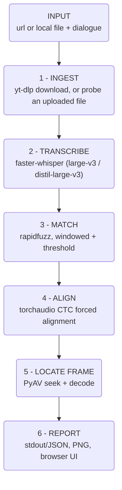

# Approach

## What it does

Input: a media URL (or a locally uploaded video file) + a target dialogue string.
Output: the timestamp, frame number, matched text, and a saved image of the first frame
in which that dialogue is spoken.

## Interpretation and core principle

- The dialogue is a **given input to search for**, not something to discover -- the
  problem statement supplies a target line and warns a different video/dialogue may be
  used at evaluation time. The program never guesses a video's "first line of dialogue."
- The reference line is **spoken, not rendered on screen** (confirmed by watching the
  reference video), so speech-to-text is the evidence, not OCR.
- **"The exact frame" is defined as** the frame containing the onset of the first word
  of the matched line, taken from that frame's own decoded timestamp, never from a
  `time * fps` formula.
- **Core principle:** the pipeline never asks *"is there dialogue here?"* -- only *"is
  this specific line here?"* A detector (speech-present, person-in-frame) is defeated by
  the reference video's distractors (title cards, other spoken lines); a discriminator
  that scores candidate text against the target string is not. So there are no filtering
  stages -- transcribe everything, then search the text.

## Architecture

Download, transcript, and OCR-less local-file probing are all cached to disk, keyed by
URL (or filename) + language + quality, so a repeat run only redoes what changed. The
web app additionally accepts a local upload as an alternative to step 1, skipping
`yt-dlp` entirely and going straight to step 2.

## Design choices

| Concern | Choice | Why |
|---|---|---|
| Download | `yt-dlp` | handles ok.ru and ~1800 other sites |
| Frame decode | `PyAV`, not OpenCV | `cv2`'s frame-index seeking is approximate on several codecs and can land on the nearest keyframe -- wrong when the deliverable is *the exact frame* |
| ASR | `faster-whisper` (`large-v3`, or `distil-large-v3` for known English) | CTranslate2 backend, several times faster than `openai-whisper`; exposes word-level timestamps |
| Fuzzy match | `rapidfuzz` | fast, and threshold-tunable against real false positives/negatives |
| Onset precision | `torchaudio` MMS_FA forced alignment (CTC) | fitting *known* text to audio is a far easier problem than transcribing it -- ~20ms precision vs. Whisper's word timestamps (~200ms) |
| Non-Latin alignment | `uroman` | MMS_FA's vocabulary is Latin-only; romanizes other scripts first |
| Web backend | FastAPI + `uvicorn`, one background worker | a single GPU can't run two transcriptions at once without severe stalling (confirmed) -- jobs are queued, never parallel |
| Web frontend | Plain HTML/CSS/JS, no build step | a reference design (React/TanStack/shadcn) was ported by hand rather than adopting its toolchain -- same visual result, no new build pipeline for a single-page app |

**Frame answer is always the decoded frame's own PTS**, never `round(onset * fps)` used
directly -- that formula is only a seek hint; a real off-by-one (7799 vs. the correct
7798) came from trusting it, since a frame's time window is containment
(`[N/fps, (N+1)/fps)`), not nearest-point rounding.

**Language-aware model choice.** `distil-large-v3` (English-only, several times faster
at decoding) is used only when English is *explicitly* requested, never for auto-detect
-- even though detection could land on English. `large-v3` degrades gracefully on a
misdetected language (still multilingual, just biased wrong); `distil-large-v3` cannot
represent non-English audio at all, so routing a misdetected video to it would be worse,
not better.

## Algorithms and techniques

- **Windowed fuzzy matching.** The transcript's word stream is scanned with a sliding
  window near the target's word count (± slack, since ASR wording drifts in length),
  scored with `rapidfuzz.fuzz.ratio` against the normalized target. Overlapping detections
  from different window sizes are collapsed via non-max suppression to one best-scoring
  candidate per real occurrence. **Score gates** whether a candidate counts as real
  (threshold); **time** decides which real candidate is *first* -- never score, since a
  cleaner-sounding later match isn't "more real" than a noisier earlier one.
- **CTC forced alignment.** A Wav2Vec2-family acoustic model scores each ~20ms audio
  frame against a small vocabulary; forced alignment (not ordinary decoding) finds the
  highest-probability monotonic path through those scores that visits the *known* target
  text's characters in order. This is only run on the few seconds around a matched
  candidate, not the whole video, so it's cheap regardless of video length.
- **Cache-key normalization.** Downloaded videos are cached by URL, but a URL is not a
  reliable dict key as-is -- `http://` vs `https://` for the same video hashed to two
  different entries in practice, causing silent redownloads. Fixed by normalizing scheme,
  host case, and trailing slash before every cache read/write.
- **Numbers in the target are a hard requirement, not just scored text.** Confirmed in
  practice: "1.4 billion years" matched "4.5 billion years" at score 88.2 (well above
  threshold), because "billion years" alone carries most of the character-level
  similarity and `rapidfuzz` has no notion that the numbers differ. A candidate is now
  rejected outright if it's missing any digit the target mentions, regardless of score --
  numbers are exact facts, not approximate text. Also, forced alignment's vocabulary is
  Latin letters only, no digits at all, so a numeral used to crash its tokenizer with a
  bare `KeyError`; numbers are now spelled out ("1.4" -> "one point four", via
  `num2words`) before alignment ever sees them.

## Assumptions

- The dialogue string is given, not inferred -- correctness means finding *that* string,
  not summarizing what's spoken.
- "First occurrence" means earliest **timestamp** among candidates that clear the match
  threshold, not the highest-scoring one.
- A locally uploaded file has no format ladder to select from, so `--quality`/quality
  selection is meaningless (and hidden in the UI) for that path.
- Evaluation may substitute a different video/dialogue, so nothing is hard-coded to the
  reference video beyond its use as the default example.

## Trade-offs and known limitations

- **No concurrent GPU support** -- one pipeline run at a time, by design (see Web
  backend above).
- **Single language assumption per video.** Whisper picks one language from the first
  ~30s and doesn't re-detect per segment; a video that switches languages partway
  through degrades outside that one assumption, which can cause a false negative if the
  target line sits in a mismatched segment. Not fixed here.
  **Scope for improvement:** a real fix needs a different algorithm, not just a
  parameter change -- `faster-whisper.transcribe()` only ever decodes with the one
  language it's given (or auto-detects once); it never transcribes a single audio track
  in more than one language per call. Handling a genuinely multi-language video would
  mean: (1) splitting the audio into segments (e.g. by silence/speaker-change
  boundaries, or fixed-size windows), (2) running language identification on each
  segment independently (`WhisperModel.detect_language()`, already used elsewhere in
  this project, is exactly the right tool here), then (3) transcribing each segment
  with *its own* detected language and stitching the resulting word lists back into one
  timeline before matching. This is a separate, larger feature from anything currently
  built -- not attempted here.
- **No VAD (voice-activity detection) filtering**, by explicit choice, after a report of
  inaccurate results from it -- the trade-off is that Whisper can still hallucinate
  generic text on a silent/non-speech opening (observed directly: a silent test clip
  transcribed as "Thanks for watching!"). This rarely causes a false positive (fuzzy
  match against a real target still fails), but can contribute to the language-detection
  issue above.
- **Short target phrases** (3-4 words) are more exposed to a coincidental fuzzy match
  than longer ones; the threshold (81, tuned empirically against real false
  positives/negatives) narrows this without eliminating it.
- **Number *form* mismatches are still unhandled, but low-risk in practice.** The number
  gate above requires the same digits, not the same *spelling* -- if the target is typed
  as "1.4" and Whisper transcribed the audio as "one point four" (or vice versa), neither
  contains the other's digit tokens and the match is rejected, a false negative. For
  decimals and quantities specifically, this is unlikely to actually happen: Whisper's
  training data overwhelmingly renders that kind of number as digits, and this was
  confirmed directly -- audio saying "1.4 billion years" transcribed as "1.4 billion
  years", not spelled out. The real exposure is smaller conversational numbers ("three
  sisters") and ordinals ("the first"), which often *do* stay as words. Not a hard
  guarantee either way, since it's an emergent pattern from training data, not a
  documented rule; a complete fix would need number-word canonicalization on top of the
  current exact-digit check. Not built.
- Non-English forced-alignment output is verified not to crash, not for real quality.
