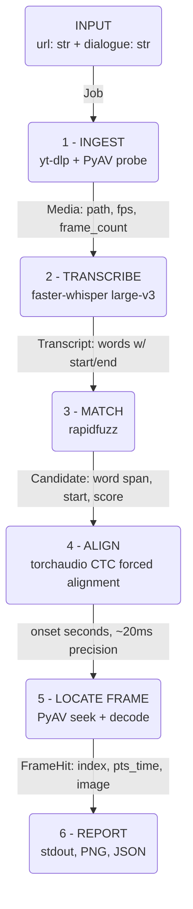

# Design and Approach

## Problem

Input: a media URL + a target dialogue string.
Output: the timestamp, frame number, dialogue text, and frame image for the first frame
in which that dialogue appears.

**Interpretation:**
- The dialogue is an **input**, not something to discover -- the statement supplies "My
  mind rebels at stagnation" and warns a different video/dialogue may be used at
  evaluation time. The program searches for a given string; it doesn't guess the video's
  first line of dialogue.
- The reference line is **spoken, not rendered on screen** (confirmed by watching the
  video: it occurs at ~05:26 with no matching subtitle text), so speech-to-text is the
  primary evidence, not OCR.
- "The exact frame" needs a stated convention since there's no subtitle to switch on:
  **the answer frame is the frame containing the onset of the first word of the matched
  line**, taken from that frame's own decoded timestamp, never from a formula.

**Core principle:** the pipeline never asks *"is there dialogue here?"* -- only *"is
this specific line here?"* The reference video has two classes of distractor (title
cards/cast names before the line; several camera-facing spoken lines that aren't the
target). Both defeat any *detector* (speech-present, person-in-frame, facing-camera).
Neither survives a *discriminator* that compares candidate text against the target
string. So there are no filtering stages -- transcribe everything, then search the text.

## Architecture

Stages 1-2 (download, transcript) are cached to disk -- expensive and deterministic, so
iterating on stages 3-6 during development never repeats them.

The web app also accepts a locally uploaded video as an alternative to stage 1: the file
is probed directly (`ingest/downloader.probe`) and handed straight to stage 2
(`pipeline.transcribe_media`), skipping `yt-dlp` entirely -- `--quality` has nothing to
act on in that case, since there's no format ladder to choose from.

## Data flow

| # | Stage | Output type | Verified value (reference video) |
|---|---|---|---|
| 0 | Parse | `Job(url, dialogue)` | `("https://ok.ru/video/248244667877", "My mind rebels at stagnation")` |
| 1 | Ingest | `Media(path, fps: Fraction, frame_count, duration, width, height)` | `fps=93844800/3914087 (23.976)`, `78204 frames`, `3261.74s`, `640x480` |
| 2 | Transcribe | `Transcript(words: list[Word], language)` | `~4500 words` |
| 3 | Match | `Candidate(word_span, start, end, text, score)` | `score=100.0, start~321s` |
| 4 | Align | `onset: float` (seconds) | `325.26s` |
| 5 | Locate | `FrameHit(index, pts_time, image)` | `index=7798` |
| 6 | Report | stdout + `answer_frame.png` + `result.json` | `05:25.222 / frame 7798` |

The narrowing is the point: ~3262s of video becomes ~4500 timed words, becomes one
candidate span, becomes one onset in seconds, becomes one integer frame index.

## Tech stack

| Concern | Choice | Reason |
|---|---|---|
| Download | `yt-dlp` | handles ok.ru and ~1800 other sites; the reference URL needs it |
| Probe / frame decode | `PyAV` | exact rational fps; PTS-accurate seeking (see below) |
| ASR | `faster-whisper` large-v3 (CUDA) | CTranslate2 backend, several times faster than `openai-whisper`; exposes word-level timestamps |
| Fuzzy match | `rapidfuzz` | fast normalized string similarity |
| Forced alignment | `torchaudio` MMS_FA (CTC) | aligning known text to audio is far easier than transcribing it, giving ~20ms onset precision |
| Non-Latin alignment | `uroman` | MMS_FA's vocabulary is Latin-only; romanizes other scripts first |
| Web backend | FastAPI + `uvicorn` | async-friendly, minimal boilerplate for a small JSON API |
| CLI | `argparse` (stdlib) | no dependency needed |

**Two choices worth defending:**
- **PyAV, not OpenCV, for frame extraction.** `cv2.CAP_PROP_POS_FRAMES` seeking is
  approximate on several codecs and can land on the nearest keyframe -- disqualifying
  when the deliverable is literally "the exact frame." PyAV seeks by presentation
  timestamp and decodes forward.
- **The decoded frame's own PTS is the answer, never `round(onset * fps)` alone.** That
  formula is a seek hint; trusting it directly caused a real off-by-one (below).

## Matching policy

Score and time answer different questions:
- **Score decides whether a candidate is real at all** (threshold, currently 81 -- see
  Findings). Below it, a candidate is noise and discarded, never ranked.
- **Time decides which real candidate is first.** Among candidates that clear the
  threshold, the earliest start wins -- never the highest score. Two genuine occurrences
  of the same line aren't "more or less real" just because ASR transcribed one more
  cleanly; the task asks for the first appearance, not the best-matching one.

**No-match handling:** if nothing clears the threshold, the program exits non-zero and
prints the best rejected candidate (text, timestamp, score) explicitly labelled as *not
the answer* -- useful for diagnosis, never presented as a low-confidence guess.

**Deliberately not built:** person/face detection ("is a speaker on screen") and
speech-presence pre-filtering. Both are detectors the reference video's distractors
defeat; the discriminator (text matching) makes them redundant, and each only adds a way
to wrongly discard a true positive. An OCR-based on-screen-text search path was also
prototyped as a second way to locate the dialogue, then removed: the problem statement
gives the dialogue as spoken text to search for, not text that might be rendered on
screen, so a second full search modality was solving a problem this task doesn't have --
scope the discriminator principle above already argues against.

## Key findings

Real problems found while building and verifying this against the reference video (and,
for the web app, live in a browser). Each was root-caused and fixed, not just noticed --
full investigation detail has been trimmed here for length; the git history and this
project's development transcript carry the complete story.

**Ingest / download reliability**
- ok.ru's own metadata is unstable across requests: a naive quality selector let an
  *unranked* named tier ("sd") race a *ranked* one, and a "mobile" fallback silently
  returns a crippled 5-format list with no resolution data. Fixed with a height-ranked
  selector plus a retry loop that specifically waits for the rich format ladder.
- A single-format HLS download can arrive as raw MPEG-TS wearing a `.mp4` extension
  unless explicitly remuxed -- `probe()` then fails with no duration. Fixed by forcing a
  real remux regardless of how the stream was fetched.
- yt-dlp's `skip_unavailable_fragments` defaults to `True`: a permanently-failed
  fragment is silently dropped and the download still reports success. Produced a real
  video, minutes shorter than verified downloads, with no error. Fixed by forcing an
  abort instead, so the existing retry loop can actually recover.
- Windows Defender can briefly lock a just-written HLS fragment file, racing yt-dlp's
  rename (`file_access_retries` default: 3 attempts, 10ms backoff -- too short for a
  real scan). Raised to 10 attempts with a real backoff.
- The cache now holds exactly one video at a time (`_evict_other_videos`), evicting the
  previous video's files whenever a new URL is requested -- the original design kept
  every video ever fetched, which is fine for local iteration but grows disk usage
  without bound for a deployed instance.

**GPU / CUDA on Windows**
- CTranslate2 (faster-whisper's backend) needs its own cuBLAS/cuDNN on `PATH`, which
  `os.add_dll_directory` alone does not provide (its own loader ignores it). Fixed by
  prepending the correct directory to `PATH` before `faster_whisper` is imported.
- Those libraries were originally installed as a separate ~2GB pip package pair
  (`nvidia-cublas-cu12`/`nvidia-cudnn-cu12`) duplicating what `torch` (needed anyway for
  forced alignment) already bundles in `torch/lib`. Pointed at torch's copies instead
  and removed the duplicate packages -- verified with a real CUDA transcription run.
- Running more than one pipeline instance concurrently on one GPU (confirmed: three
  processes, ~4GB VRAM each, one 8GB card) causes severe stalling, not a clean error.
  The web app's job queue processes strictly one job at a time as a direct consequence.

**Transcription accuracy**
- Whisper's language auto-detect samples only the first ~30s of audio; a non-speech
  opening (title music) can mis-detect the language and trigger a repetition-loop
  hallucination that silently drops real content from the transcript. `--language`
  lets a known language skip detection.
- The final frame is reproducible despite this: four independent full transcriptions of
  the reference video produced three different wordings for the target line (clean,
  "its" for "at", "dwells" for "at"), yet the two that reached forced alignment landed
  on the identical frame (7798). Alignment fits the *fixed target text* to the audio,
  never whatever Whisper happened to transcribe, so ASR noise in stage 2 doesn't
  propagate to the final answer.

**Matching threshold** -- tuned empirically, not derived. 70 let real false positives
through ("I am the king" -> "I am in" at score 70.0). 90 was tried next and reverted: it
rejects a documented genuine match that scored 89.3 in one transcription run. The
survivor check is `score >= threshold`, so 80 doesn't reject a score of exactly 80.0 --
confirmed directly against a real false positive ("who are you" -> "where you" at 80.0).
Settled on **81**: clears every observed false positive with margin, stays below every
verified genuine score. There is no single threshold immune to both directions for every
possible query -- false-positive scores climb with how short/common the phrase is,
genuine matches can dip under ASR noise, and those ranges can overlap. A more reliable
fix for short/ambiguous queries would use forced alignment as a confirmation signal
(a coincidental text match wouldn't align cleanly against different audio); not built.

**Frame indexing off-by-one.** A `round(seconds * fps)` formula gave frame 7799 for a
real onset where the actually-decoded frame (verified against its own PTS) was 7798,
because the timestamp's fractional frame position was past `round()`'s 0.5 threshold
despite still falling inside frame 7798's window (`[N/fps, (N+1)/fps)` is containment,
not nearest-neighbour). Fixed by making the decoded frame's own PTS authoritative
everywhere, never a pre-computed formula.

**Non-Latin scripts.** Forced alignment's vocabulary is 27 unaccented Latin letters;
non-Latin target text raised a plain `KeyError` (confirmed: Russian crashed, French did
not). Fixed by romanizing target text with `uroman` before tokenizing, matching how the
underlying model checkpoint (`ctc_alignment_mling_uroman`) was actually trained. The fix
is verified against the crash; real alignment *quality* on non-English audio is not.

## Known limitations

- No concurrent GPU support -- one pipeline run at a time, by design (see above).
- Short target phrases (3-4 words) remain more exposed to a coincidental fuzzy match
  than longer ones; the threshold narrows this risk without eliminating it.
- Non-English forced-alignment quality is unverified beyond "does not crash."
- Auto-detected language can still occasionally mis-transcribe a non-speech opening;
  `--language` is the documented workaround, not a code fix.
