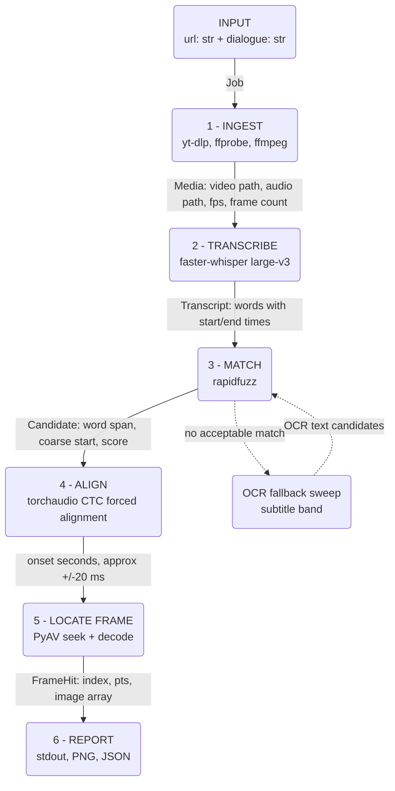

# Design and Approach

## Problem restated

Input: a media URL + a target dialogue string.
Output: the timestamp, frame number, dialogue text, and frame image for the **first**
frame in which that dialogue appears.

## Interpretation of the statement

- The dialogue is an **input**, not something to be discovered. The statement supplies
  "My mind rebels at stagnation" and warns that a different video/dialogue may be used
  at evaluation time. So the program searches for a given string; it does not return the
  video's first line of dialogue.
- The reference line is **spoken, not rendered on screen** (verified by watching the
  reference video: it occurs at approximately 05:26 with no matching on-screen text).
  So speech-to-text is the primary evidence, not OCR.
- Because there is no subtitle to switch on, "the exact frame" needs a stated
  convention. **We define the answer frame as the frame containing the onset of the
  first word of the matched line.**

## Core principle

The pipeline never asks *"is there dialogue here?"* It only ever asks
*"is **this specific line** here?"*

This matters because the reference video contains two classes of distractor:

- on-screen text before the target line (title card, cast names), and
- several camera-facing spoken lines that are not the target.

Both defeat any *detector* (speech-present, person-in-frame, facing-camera,
text-on-screen). Neither survives a *discriminator* that compares candidate text
against the target string -- cast names and unrelated lines simply do not match. So the
design carries no filtering stages at all: transcribe everything, then search the text.

## Pipeline

1. **Ingest** - resolve the URL to a local media file; probe fps, frame count, duration.
   All time <-> frame conversion goes through the probed fps.
2. **Transcribe** - full-audio speech-to-text with **word-level** timestamps.
3. **Match** - normalise (casefold, strip punctuation) and fuzzy-match the target
   dialogue against the word stream. Fuzzy is mandatory: ASR output carries no
   punctuation or casing and will contain errors. Returns the best span plus a score.
4. **Refine to frame precision** - Whisper-style word timestamps drift by roughly
   +/-200 ms, which is several frames. To justify the word "exact":
   a. forced alignment (CTC) over the matched span only, tightening first-word onset to
      roughly +/-20 ms, then
   b. optionally snap to speech onset via energy/VAD in a small window, since alignment
      marks phoneme start which can precede audible onset.
   Then `frame = round(onset * fps)`.
5. **Report** - print timestamp, frame number, extracted text; write the frame as PNG
   plus a JSON record.

## Architecture

Stages 1 and 2 are cached to disk: the download and the transcript are expensive and
deterministic, so development iterates on stages 3-6 without repeating them.

## Data flow and types

| # | Stage | Input | Output type | Example value (reference video) |
|---|---|---|---|---|
| 0 | Parse | CLI args | `Job(url: str, dialogue: str)` | `("https://ok.ru/video/248244667877", "My mind rebels at stagnation")` |
| 1 | Ingest | `Job` | `Media(path: Path, title: str, fps: Fraction, frame_count: int, duration: float, width: int, height: int)` | **measured:** `fps=93844800/3914087 (23.976)`, `frame_count=78204`, `duration=3261.74`, `640x480`, 431.4 MiB |
| 2 | Transcribe | `Media.audio_path` (16 kHz mono PCM) | `Transcript(words: list[Word], language: str)` where `Word(text: str, start: float, end: float, prob: float)` | `~8000 words, language="en"` |
| 3 | Match | `Transcript`, `str` | `list[Candidate]` where `Candidate(word_span: tuple[int, int], start: float, end: float, text: str, score: float)` | `1 candidate, score~96, start~326.2` |
| 4 | Align | `np.ndarray` (float32 waveform slice), `str` | `Onset(t: float, confidence: float)` | `t=326.204` |
| 5 | Locate | `Onset`, `Media` | `FrameHit(index: int, pts: float, image: np.ndarray)` | `index=7821` at 23.976 fps, `image shape (480, 640, 3) uint8` |
| 6 | Report | `FrameHit`, `Candidate`, `Onset` | stdout + `outputs/frame.png` + `outputs/result.json` | `00:05:26.204 / frame 7821` |

The narrowing is the point: 3261.74 s of video becomes ~8000 timed words, becomes one
candidate span, becomes one onset in seconds, becomes one integer frame index.

## Tech stack

| Concern | Choice | Reason |
|---|---|---|
| Env / packaging | `uv` | already the project's toolchain |
| Download | `yt-dlp` | ships an Odnoklassniki extractor; handles arbitrary evaluation URLs |
| Demux / audio extract | `ffmpeg` via `imageio-ffmpeg` | bundled binary, no system install needed |
| Probe | `PyAV` | `imageio-ffmpeg` bundles ffmpeg but **not** ffprobe; PyAV is already needed for frame decoding and exposes fps as an exact rational |
| ASR | `faster-whisper` large-v3, float16 / CUDA | CTranslate2 backend is several times faster than `openai-whisper` at equal weights, and ~5 GB fits the 4060; exposes `word_timestamps=True` |
| Fuzzy match | `rapidfuzz` | `partial_ratio_alignment` returns both a score and the matched substring offsets, which is exactly what stage 3 needs |
| Forced alignment | `torchaudio` MMS_FA / wav2vec2 CTC | torch is already installed with CUDA; aligning known text is far easier than transcribing it, giving sub-frame onset |
| Frame decode | `PyAV` | PTS-accurate seeking; arrives as a `faster-whisper` dependency |
| Image write | `Pillow` / `opencv-python` | already installed |
| CLI | `argparse` (stdlib) | no dependency required |
| Tests | `pytest` | already configured |

### Non-obvious choices

- **PyAV rather than OpenCV for frame extraction.** `cv2.CAP_PROP_POS_FRAMES` seeking is
  approximate on several codecs -- it can land on the nearest keyframe. When the
  deliverable is literally "the exact frame," that is disqualifying. PyAV seeks by
  presentation timestamp and decodes forward, so the returned frame is the one asked for.
- **Read the decoded frame's PTS rather than trusting `round(onset * fps)` alone.**
  The multiplication is the nominal answer; the decoded PTS is the verification. For
  variable-frame-rate sources, PTS ordering is the only correct basis for a frame index.
- **WhisperX is the main alternative**, since it performs stages 2 and 4 together. It is
  rejected here for a heavier and more version-sensitive dependency tree, and because
  keeping alignment separate makes the precision argument explicit rather than implicit.

## Fallbacks

- If ASR yields no acceptable match (wrong language, poor audio), fall back to an OCR
  sweep for burned-in subtitles -- a *different* evaluation video may legitimately carry
  the line as on-screen text. The same target-matching rule applies, so title cards and
  credits are inert.
- If neither source matches, report failure with the best candidate and its score rather
  than returning a guess.

## Matching policy: threshold, then earliest -- not highest score

Score and time answer two different questions and must not be conflated:

- **Score decides what counts as a real match at all.** rapidfuzz's normalised score
  (0-100) against the target string. Default accept threshold: **70**. Below it, a
  candidate is noise and is discarded outright, not ranked.
  - >= 85 : confident match
  - 70-85 : accepted, reported as low-confidence
  - < 70  : rejected -- contributes to "not found", never returned as the answer
- **Time decides which real match is first.** Among candidates that clear the threshold,
  the answer is the one with the *earliest* start time -- never the one with the highest
  score. Two genuine occurrences of the same line are not "more or less genuine" than
  each other just because ASR transcribed one slightly more cleanly; the task asks for
  the first appearance, not the best-matching one. Score's job stops at the threshold.
  - Example: occurrences scoring 99 at 05:26 and 100 at 40:10 -- the answer is 05:26.
    Sorting by score first would silently answer "which occurrence matched best",
    not "where does the dialogue first appear".
  - A tie-break on score only applies in the degenerate case of two candidates at the
    exact same timestamp, which should not occur in practice.

## No-match handling

If nothing clears the threshold, the video does not contain the dialogue for this run's
purposes. The program:

- exits non-zero;
- prints the best candidate found (text, timestamp, score) explicitly labelled as
  *below threshold, not returned as the answer* -- useful for diagnosing whether the
  threshold, the ASR, or the input dialogue itself is the issue;
- never returns a low-confidence guess as if it were a confident answer.

## Ambiguity and uncertainty handling

- Every candidate carries a match score; results below threshold are reported as
  low-confidence or rejected per the policy above, never silently accepted.
- If the line appears more than once above threshold, return the earliest and list the
  others (with their scores and timestamps) for transparency.
- Report which evidence source (ASR / forced alignment / OCR) produced the answer, and
  the precision bound that source implies.

### On the phrase "on-screen dialogue"

The statement's intro says "an on-screen dialogue appears." This is read as scene-setting
rather than as a constraint to verify, because:

- the reference video contains several camera-facing spoken lines that are not the
  answer, so speaker visibility does not discriminate the target frame;
- none of the four required outputs concerns the speaker's visibility; and
- the narrow reading breaks on voice-over, phone calls, off-screen speakers, animation
  and documentary footage -- all fair game since the evaluators may swap the video.

Every real application of this tool (media search, clip retrieval, subtitle alignment and
QC, dubbing, archive discovery) asks "where is this line?", never "is the speaker's face
visible?". The general reading is therefore taken.

**If the requirement is changed to demand a visible speaker**, that is a *post-filter on
the result, not a stage in the search*. Run face detection on the single frame already
identified: it then annotates or visibly rejects a known answer. The same check placed
upstream would run before the answer is known, where a miss silently destroys the correct
frame with no way to recover it. Same computation, opposite risk profile.

## Deliberately not doing

- **Person / face detection to decide whether a speaker is "on screen."** The reference
  video contains multiple camera-facing speakers who are not the answer, so presence of
  a face carries no discriminating signal. It adds failure modes (masks, backs of heads,
  crowd shots, voice-over, reaction cutaways) without adding information, and none of the
  four required outputs depend on it.
- **Filtering frames by "speech is present."** Same reasoning: the matcher already
  discriminates, so pre-filtering can only discard true positives.

## Stage 2: audio extraction and transcription

**Audio extraction** (`audio/extract.py`) decodes with PyAV rather than shelling out to
ffmpeg a second time -- PyAV already links the ffmpeg libraries (it is already a
dependency of the ingest stage), so this avoids a second subprocess and a second place to
wire up `ffmpeg_location`. Output is 16 kHz mono PCM WAV: Whisper's encoder was trained at
16 kHz, so resampling once here means transcription never has to reason about whatever
sample rate the source video happens to use. Like the download, a non-empty output file is
treated as cached and reused -- decoding a 54-minute episode is itself a real cost.

**Transcription** (`audio/transcribe.py`) uses `faster-whisper`, a CTranslate2 inference
wrapper. The pip package ships no model weights: the first `WhisperModel(...)` call for a
given size downloads the converted weights from Hugging Face Hub and caches them locally,
and every call after that loads from cache with no network access. Weights are cached
under `data/models/` (via `download_root`) rather than the default global HF cache, so
they are visible and gitignored alongside the rest of what the pipeline downloads,
consistent with the media cache.

`word_timestamps=True` is mandatory, not an optimisation -- the matcher (stage 3) needs to
know exactly which word the target dialogue starts on, and Whisper's default
segment-level timestamps mark a whole sentence, which is useless for locating one word's
onset. Words without a usable timestamp are dropped rather than kept with a fabricated
time, since a wrong timestamp is worse than a missing word once the pipeline trusts
`word.start` as ground truth for frame location.

Default model: `large-v3` in `device="auto"` (CUDA on this machine, float16). Exposed as a
parameter so development can drop to `medium`/`small` for faster iteration without
touching code.

## Portability across sites (yt-dlp)

`yt-dlp` supports ~1,800 extractors, and the ingest path (download / cache / probe) is
generic -- `av.open()` reads any container, the cache indexes by URL regardless of site.
The one site-specific piece is `--quality`: ok.ru's named tiers (`mobile`/`lowest`/`low`/
`sd`/`hd`) are literal format ids on that extractor only. Each tier therefore carries a
generic height-bounded fallback (`_GENERIC_FALLBACK` in `ingest/downloader.py`) so the
flag still means something on other sites, with `best` as the final catch-all everywhere.

## "best"/"hd" silently landing on a worse tier -- found via real testing

Confirmed with a live run: `--quality hd` produced a 960x720 file while `--quality best`
produced the same 720x480 file as `sd` -- i.e. "best" was picking the *worst* of the two.
Root cause traced into yt-dlp's Odnoklassniki extractor source
(`yt_dlp/extractor/odnoklassniki.py`): it tries a "desktop" page first, which resolves an
HLS manifest into per-variant formats with real width/height, and falls back to a
"mobile" page on *any* error from the desktop attempt -- and the mobile page's 5 named
tiers (`mobile/lowest/low/sd/hd`) report **no** height or bitrate at all. Because this
host resets connections constantly, the desktop attempt fails often, and the fallback
*succeeds* (no exception raised) with worse, unranked data -- so a selector like
`bestvideo+bestaudio/best` had nothing to sort by and picked close to arbitrarily. The
ordinary download-retry loop never caught this, because a "successful" mobile fallback
is not a failure by yt-dlp's own accounting.

Fixed: metadata extraction is now retried independently of the download (`_extract_rich`
in `ingest/downloader.py`) until a format list carrying real per-format resolution is
observed, and the actual download reuses that verified metadata via
`ydl.process_ie_result(...)` rather than re-querying the extractor (which could re-roll
the mobile fallback a second time). Verified with a simulate-only run: format selection
now deterministically resolves to `hls-2565` (960x720), the true best available, instead
of an arbitrary named tier.

### Investigated further: is 960x720 really the ceiling, or just what's reachable?

The reference video's raw metadata JSON was fetched directly (bypassing yt-dlp) to check
for a higher-resolution source the extractor might be missing. Result: `ondemandDash`,
`hlsMasterPlaylistUrl`, `metadataWebmUrl`, and `metadataEmbedded` are **all absent from
the payload** -- not failing to load, never offered for this video at all. The only
sources present are the 5 unranked named tiers and one HLS ladder capping at 960x720.
**960x720 is therefore the true maximum obtainable for this video via ok.ru**, not a
limitation of this tool. (Content note: this is a 1980s Granada TV production: any
"2160p" label seen elsewhere, e.g. in ok.ru's own web player, is almost certainly a
client-side upscale of the same source material, not additional real detail -- and would
not improve the pipeline's actual accuracy, only file size and download time.)

## Selection landing on an unfixed HLS stream -- found via real testing

Found in practice: a plain `--quality sd` run failed at the probe stage with
"Could not determine duration". The downloaded file (`file(1)`) was **raw MPEG-TS
wearing an `.mp4` extension** -- PyAV could decode its h264/aac streams, but neither
stream nor the container carried duration metadata. A leftover
`<id>.mp4.part-Frag22.part` and `<id>.mp4.ytdl` confirmed yt-dlp's HLS *fragment*
downloader had been used, not the plain progressive `sd` stream that was requested.

Root cause: the previous selector tried the literal named tier first
(`"sd/bestvideo[...]+bestaudio/best[...]/best"`). `bestvideo[height<=480]+bestaudio`
requires *separate* video-only and audio-only formats; ok.ru's `hls-*` variants are
muxed, so that alternative matches nothing and falls through to `best[height<=480]`.
Once `_extract_rich` guarantees the HLS ladder's real (ranked) resolution data is always
present, that ranked data now consistently beats the literal, **unranked** `sd` tier in
this comparison -- so selection landed on an HLS variant instead. The selector string
also had a latent bug, duplicating `/best` at the end.
(A second, still-unresolved possibility for the initial corruption specifically: earlier
ad hoc testing in this session may have left inconsistent cache/partial-download state in
`data/media/` directly, rather than in its own scratch directory -- the fixes below make
the pipeline robust to that regardless of which cause was primary.)

Three fixes, all in `ingest/downloader.py`:

1. **Selector no longer special-cases the literal named tier at all** -- ok.ru's tiers
   carry no resolution or bitrate (established two sections up), so racing unranked data
   against ranked data was always the wrong comparison to set up. Every tier is now a
   pure height-bounded selector (`_GENERIC_FALLBACK`), deterministic on every site.
2. **A `FFmpegVideoRemuxer` postprocessor is always attached**, so a single HLS-selected
   stream is guaranteed a real MP4 container regardless of how yt-dlp fetched it --
   `probe()` can no longer encounter unfixed MPEG-TS.
3. **`_evict_stale` now also purges `.part`, `.part-FragN.part`, and `.ytdl` leftovers**
   sharing the target file's stem, not just the previous media file. Resuming from
   partial-download state left by a *different* selection than the one about to run was
   the direct mechanism that produced the corrupted file.

## Cache keyed on (url, quality), not url alone

Found in practice: the cache index originally keyed on URL only, so requesting `--quality
hd` after already having an `sd` copy of the same URL silently returned the stale `sd`
file without ever contacting the network -- the quality flag looked like it did nothing.

Fixed: the index now stores a `quality` field per URL, and `lookup_cached` only counts as
a hit when both the URL *and* the requested quality match. A legacy entry written before
this field existed (no `quality` key) is treated as a miss rather than trusted, so it is
naturally replaced on next use.

On a quality mismatch, the previous file for that URL is deleted (`_evict_stale`) before
the new download starts -- yt-dlp's `outtmpl` is quality-agnostic (`%(id)s.%(ext)s`), so
without this a same-quality re-download would be skipped by yt-dlp's own
already-exists check, and a different-quality re-download would silently overwrite the
old file outside the index's knowledge, leaving `.cache.json` and disk inconsistent.

This also answers the general "does the cache evict" question precisely: a **different
URL** is never evicted by a new download -- both persist side by side, since cache
lifetime has no TTL (see below). The **same URL at a new quality** now *is* replaced,
since keeping more than one quality tier of the same video serves no purpose here.

## DASH sites (no muxed format) -- found via real YouTube test

Modern YouTube serves DASH: every stream is either video-only or audio-only, with
**zero formats containing both**. A naive selector like `best[height<=480]` requires a
single muxed format and matches nothing there, so the whole download fails on every
retry -- confirmed against a real YouTube URL, where all 48 available formats had
`vcodec=none` or `acodec=none`, never both present.

Fixed in `_GENERIC_FALLBACK` (`ingest/downloader.py`): each tier now tries a
`bestvideo[...]+bestaudio` pair first (yt-dlp downloads both and muxes them with
ffmpeg), falling back to a single muxed format only for sites that still offer one.
This requires yt-dlp to know where ffmpeg is -- `imageio_ffmpeg.get_ffmpeg_exe()` is
passed explicitly via `ffmpeg_location`, since yt-dlp does not discover a
pip-installed ffmpeg on its own. `merge_output_format: "mp4"` keeps the container
consistent regardless of source codecs.

Verified end to end on `https://youtu.be/jR3rWCBeO6M`: 18.3 MiB video + 4.5 MiB audio
downloaded and merged into a 22.7 MiB mp4, correctly probed at 24.000 fps / 8335 frames.
The ok.ru reference video and its cache entry were unaffected by the change.

## Cache lifetime

Entries in `data/media/.cache.json` never expire automatically. This is deliberate: the
input is a URL to a fixed video, not a live stream, so the file at that URL is not
expected to change -- there is no staleness to invalidate against. The only real cost is
disk space (the reference video is 431 MiB), which is why `data/media/` is gitignored.

## Stage 1 notes (implemented)

Measured on the reference video: 431.4 MiB at `sd`, 640x480, **23.976 fps**
(`93844800/3914087`), 3261.74 s, 78204 frames.

That frame rate is the argument for `Fraction`: at 23.976 fps the frame for t=326.204 s
is 7821, whereas assuming 25 fps would give 8155 -- a 334-frame error, roughly 14 seconds
of video. The rate must be read from the file, never assumed.

Two obstacles found in practice, both handled in `ingest/downloader.py`:

1. **No CA bundle.** The venv had no `certifi` and `ssl.get_default_verify_paths()`
   returned `None`, so the media CDN (`vd346.okcdn.ru`) failed certificate verification
   while page extraction still worked. `certifi` is therefore a hard dependency.
2. **Intermittent connection resets.** ok.ru resets roughly half of all TLS handshakes
   (`WinError 10054`). Extraction is retried up to 5 times with linear backoff, and the
   transfer uses 10 MiB chunks with resume so a mid-transfer drop costs one chunk.

Downloads are cached in `data/media/.cache.json` keyed by URL. This is checked *before*
any network call -- yt-dlp would otherwise re-extract the page merely to learn the output
filename, which on this host costs ~14 s and can fail outright. A cached run is 0.56 s and
works offline.

## Known-good reference (regression anchor)

| Field | Value |
|---|---|
| URL | https://ok.ru/video/248244667877 |
| Dialogue | "My mind rebels at stagnation" |
| Expected timestamp | ~00:05:26 (human-verified, second-level precision) |

Any refactor should still land within a second of this.

## Environment notes

- GPU: RTX 4060 Laptop, `torch 2.5.1+cu121`, CUDA available -- `faster-whisper large-v3`
  in float16 (~5 GB) fits, and better transcription means better timestamps.
- Not yet installed: `ffmpeg`, `ffprobe`, `yt-dlp`.
- `yt-dlp` ships an Odnoklassniki extractor; confirm it resolves this URL on first run.
