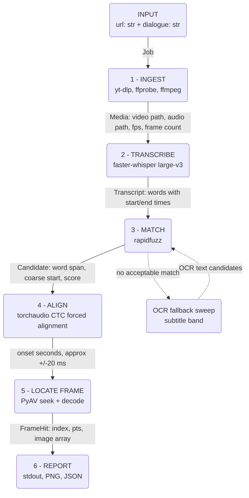

# Design and Approach

## Problem restated

Input: a media URL + a target dialogue string.
Output: the timestamp, frame number, dialogue text, and frame image for the **first**
frame in which that dialogue appears.

## Interpretation of the statement

- The dialogue is an **input**, not something to be discovered. The statement supplies
  "My mind rebels at stagnation" and warns that a different video/dialogue may be used
  at evaluation time. So the program searches for a given string; it does not return the
  video's first line of dialogue.
- The reference line is **spoken, not rendered on screen** (verified by watching the
  reference video: it occurs at approximately 05:26 with no matching on-screen text).
  So speech-to-text is the primary evidence, not OCR.
- Because there is no subtitle to switch on, "the exact frame" needs a stated
  convention. **We define the answer frame as the frame containing the onset of the
  first word of the matched line.**

## Core principle

The pipeline never asks *"is there dialogue here?"* It only ever asks
*"is **this specific line** here?"*

This matters because the reference video contains two classes of distractor:

- on-screen text before the target line (title card, cast names), and
- several camera-facing spoken lines that are not the target.

Both defeat any *detector* (speech-present, person-in-frame, facing-camera,
text-on-screen). Neither survives a *discriminator* that compares candidate text
against the target string -- cast names and unrelated lines simply do not match. So the
design carries no filtering stages at all: transcribe everything, then search the text.

## Pipeline

1. **Ingest** - resolve the URL to a local media file; probe fps, frame count, duration.
   All time <-> frame conversion goes through the probed fps.
2. **Transcribe** - full-audio speech-to-text with **word-level** timestamps.
3. **Match** - normalise (casefold, strip punctuation) and fuzzy-match the target
   dialogue against the word stream. Fuzzy is mandatory: ASR output carries no
   punctuation or casing and will contain errors. Returns the best span plus a score.
4. **Refine to frame precision** - Whisper-style word timestamps drift by roughly
   +/-200 ms, which is several frames. To justify the word "exact":
   a. forced alignment (CTC) over the matched span only, tightening first-word onset to
      roughly +/-20 ms, then
   b. optionally snap to speech onset via energy/VAD in a small window, since alignment
      marks phoneme start which can precede audible onset.
   Then `frame = round(onset * fps)`.
5. **Report** - print timestamp, frame number, extracted text; write the frame as PNG
   plus a JSON record.

## Architecture



Stages 1 and 2 are cached to disk: the download and the transcript are expensive and
deterministic, so development iterates on stages 3-6 without repeating them.

## Data flow and types

| # | Stage | Input | Output type | Example value (reference video) |
|---|---|---|---|---|
| 0 | Parse | CLI args | `Job(url: str, dialogue: str)` | `("https://ok.ru/video/248244667877", "My mind rebels at stagnation")` |
| 1 | Ingest | `Job` | `Media(path: Path, title: str, fps: Fraction, frame_count: int, duration: float, width: int, height: int)` | **measured:** `fps=93844800/3914087 (23.976)`, `frame_count=78204`, `duration=3261.74`, `640x480`, 431.4 MiB |
| 2 | Transcribe | `Media.audio_path` (16 kHz mono PCM) | `Transcript(words: list[Word], language: str)` where `Word(text: str, start: float, end: float, prob: float)` | `~8000 words, language="en"` |
| 3 | Match | `Transcript`, `str` | `list[Candidate]` where `Candidate(word_span: tuple[int, int], start: float, end: float, text: str, score: float)` | `1 candidate, score~96, start~326.2` |
| 4 | Align | `np.ndarray` (float32 waveform slice), `str` | `Onset(t: float, confidence: float)` | `t=326.204` |
| 5 | Locate | `Onset`, `Media` | `FrameHit(index: int, pts: float, image: np.ndarray)` | `index=7821` at 23.976 fps, `image shape (480, 640, 3) uint8` |
| 6 | Report | `FrameHit`, `Candidate`, `Onset` | stdout + `outputs/frame.png` + `outputs/result.json` | `00:05:26.204 / frame 7821` |

The narrowing is the point: 3261.74 s of video becomes ~8000 timed words, becomes one
candidate span, becomes one onset in seconds, becomes one integer frame index.

## Tech stack

| Concern | Choice | Reason |
|---|---|---|
| Env / packaging | `uv` | already the project's toolchain |
| Download | `yt-dlp` | ships an Odnoklassniki extractor; handles arbitrary evaluation URLs |
| Demux / audio extract | `ffmpeg` via `imageio-ffmpeg` | bundled binary, no system install needed |
| Probe | `PyAV` | `imageio-ffmpeg` bundles ffmpeg but **not** ffprobe; PyAV is already needed for frame decoding and exposes fps as an exact rational |
| ASR | `faster-whisper` large-v3, float16 / CUDA | CTranslate2 backend is several times faster than `openai-whisper` at equal weights, and ~5 GB fits the 4060; exposes `word_timestamps=True` |
| Fuzzy match | `rapidfuzz` | `partial_ratio_alignment` returns both a score and the matched substring offsets, which is exactly what stage 3 needs |
| Forced alignment | `torchaudio` MMS_FA / wav2vec2 CTC | torch is already installed with CUDA; aligning known text is far easier than transcribing it, giving sub-frame onset |
| Frame decode | `PyAV` | PTS-accurate seeking; arrives as a `faster-whisper` dependency |
| Image write | `Pillow` / `opencv-python` | already installed |
| CLI | `argparse` (stdlib) | no dependency required |
| Tests | `pytest` | already configured |

### Non-obvious choices

- **PyAV rather than OpenCV for frame extraction.** `cv2.CAP_PROP_POS_FRAMES` seeking is
  approximate on several codecs -- it can land on the nearest keyframe. When the
  deliverable is literally "the exact frame," that is disqualifying. PyAV seeks by
  presentation timestamp and decodes forward, so the returned frame is the one asked for.
- **Read the decoded frame's PTS rather than trusting `round(onset * fps)` alone.**
  The multiplication is the nominal answer; the decoded PTS is the verification. For
  variable-frame-rate sources, PTS ordering is the only correct basis for a frame index.
- **WhisperX is the main alternative**, since it performs stages 2 and 4 together. It is
  rejected here for a heavier and more version-sensitive dependency tree, and because
  keeping alignment separate makes the precision argument explicit rather than implicit.

## Fallbacks

- If ASR yields no acceptable match (wrong language, poor audio), fall back to an OCR
  sweep for burned-in subtitles -- a *different* evaluation video may legitimately carry
  the line as on-screen text. The same target-matching rule applies, so title cards and
  credits are inert.
- If neither source matches, report failure with the best candidate and its score rather
  than returning a guess.

## Matching policy: threshold, then earliest -- not highest score

Score and time answer two different questions and must not be conflated:

- **Score decides what counts as a real match at all.** rapidfuzz's normalised score
  (0-100) against the target string. Default accept threshold: **70**. Below it, a
  candidate is noise and is discarded outright, not ranked.
  - >= 85 : confident match
  - 70-85 : accepted, reported as low-confidence
  - < 70  : rejected -- contributes to "not found", never returned as the answer
- **Time decides which real match is first.** Among candidates that clear the threshold,
  the answer is the one with the *earliest* start time -- never the one with the highest
  score. Two genuine occurrences of the same line are not "more or less genuine" than
  each other just because ASR transcribed one slightly more cleanly; the task asks for
  the first appearance, not the best-matching one. Score's job stops at the threshold.
  - Example: occurrences scoring 99 at 05:26 and 100 at 40:10 -- the answer is 05:26.
    Sorting by score first would silently answer "which occurrence matched best",
    not "where does the dialogue first appear".
  - A tie-break on score only applies in the degenerate case of two candidates at the
    exact same timestamp, which should not occur in practice.

## No-match handling

If nothing clears the threshold, the video does not contain the dialogue for this run's
purposes. The program:

- exits non-zero;
- prints the best candidate found (text, timestamp, score) explicitly labelled as
  *below threshold, not returned as the answer* -- useful for diagnosing whether the
  threshold, the ASR, or the input dialogue itself is the issue;
- never returns a low-confidence guess as if it were a confident answer.

## Ambiguity and uncertainty handling

- Every candidate carries a match score; results below threshold are reported as
  low-confidence or rejected per the policy above, never silently accepted.
- If the line appears more than once above threshold, return the earliest and list the
  others (with their scores and timestamps) for transparency.
- Report which evidence source (ASR / forced alignment / OCR) produced the answer, and
  the precision bound that source implies.

### On the phrase "on-screen dialogue"

The statement's intro says "an on-screen dialogue appears." This is read as scene-setting
rather than as a constraint to verify, because:

- the reference video contains several camera-facing spoken lines that are not the
  answer, so speaker visibility does not discriminate the target frame;
- none of the four required outputs concerns the speaker's visibility; and
- the narrow reading breaks on voice-over, phone calls, off-screen speakers, animation
  and documentary footage -- all fair game since the evaluators may swap the video.

Every real application of this tool (media search, clip retrieval, subtitle alignment and
QC, dubbing, archive discovery) asks "where is this line?", never "is the speaker's face
visible?". The general reading is therefore taken.

**If the requirement is changed to demand a visible speaker**, that is a *post-filter on
the result, not a stage in the search*. Run face detection on the single frame already
identified: it then annotates or visibly rejects a known answer. The same check placed
upstream would run before the answer is known, where a miss silently destroys the correct
frame with no way to recover it. Same computation, opposite risk profile.

## Deliberately not doing

- **Person / face detection to decide whether a speaker is "on screen."** The reference
  video contains multiple camera-facing speakers who are not the answer, so presence of
  a face carries no discriminating signal. It adds failure modes (masks, backs of heads,
  crowd shots, voice-over, reaction cutaways) without adding information, and none of the
  four required outputs depend on it.
- **Filtering frames by "speech is present."** Same reasoning: the matcher already
  discriminates, so pre-filtering can only discard true positives.

## Stage 2: audio extraction and transcription

**Audio extraction** (`audio/extract.py`) decodes with PyAV rather than shelling out to
ffmpeg a second time -- PyAV already links the ffmpeg libraries (it is already a
dependency of the ingest stage), so this avoids a second subprocess and a second place to
wire up `ffmpeg_location`. Output is 16 kHz mono PCM WAV: Whisper's encoder was trained at
16 kHz, so resampling once here means transcription never has to reason about whatever
sample rate the source video happens to use. Like the download, a non-empty output file is
treated as cached and reused -- decoding a 54-minute episode is itself a real cost.

**Transcription** (`audio/transcribe.py`) uses `faster-whisper`, a CTranslate2 inference
wrapper. The pip package ships no model weights: the first `WhisperModel(...)` call for a
given size downloads the converted weights from Hugging Face Hub and caches them locally,
and every call after that loads from cache with no network access. Weights are cached
under `data/models/` (via `download_root`) rather than the default global HF cache, so
they are visible and gitignored alongside the rest of what the pipeline downloads,
consistent with the media cache.

`word_timestamps=True` is mandatory, not an optimisation -- the matcher (stage 3) needs to
know exactly which word the target dialogue starts on, and Whisper's default
segment-level timestamps mark a whole sentence, which is useless for locating one word's
onset. Words without a usable timestamp are dropped rather than kept with a fabricated
time, since a wrong timestamp is worse than a missing word once the pipeline trusts
`word.start` as ground truth for frame location.

Default model: `large-v3` in `device="auto"` (CUDA on this machine, float16). Exposed as a
parameter so development can drop to `medium`/`small` for faster iteration without
touching code.

## Threshold raised from 70 to 80 after two real false positives

Reported directly: `"I am the king"` returned `"I am in"`, and `"What is it"` returned
`"What's"` -- both wrong, both confidently presented as answers. Computed the actual
scores rather than guessing: `"i am in"` against `"i am the king"` scored **70.0** --
exactly the old threshold, a razor-thin pass. `"what's"` against `"what is it"` scored
**75.0**. Every genuine match verified so far in this project scores well clear of that:
89.3, 94.7, 100.0. 80 sits cleanly in the 14-point gap between the worst false positive
and the best genuine match, with margin on both sides.

**Not just noise suppression -- this uncovered a real correctness bug.** Both reported
phrases turned out to genuinely exist in the video. The old threshold let an earlier,
coincidental, low-scoring match win under the earliest-wins policy *before the matcher
ever got far enough to see the true occurrence*. Re-running both queries after the fix:

- `"I am the king"` -> now correctly finds the exact (100.0) occurrence at 12:56.46,
  rejecting the earlier "I am in" noise (70.0) outright.
- `"What is it"` -> now correctly finds an exact (100.0) match at 04:44.34 -- and a
  second exact occurrence exists later at 42:30.52; earliest-wins correctly picked the
  first.

Short target phrases (3-4 words) remain inherently more exposed to coincidental partial
matches than longer ones -- a stricter threshold narrows this risk, it does not eliminate
it for very short queries. Documented in `search/matcher.py` directly, with two new
regression tests locking in the exact reported false positives (`test_matcher.py`).
Verified the canonical reference match (frame 7798) is unaffected by the raise.

## Two more real download bugs, found via a user running concurrent tests

Investigating a "no output" report surfaced two unrelated, real problems -- not one.

**1. Windows Defender racing yt-dlp's per-fragment rename.** HLS downloads write one
small file per fragment then rename it; a real-time AV scan can briefly lock a
just-written file, racing the rename (`WinError 32`). Traced to the exact yt-dlp
mechanism, not guessed: `file_access_retries` (default 3, matching the observed "giving
up after 3 retries") is a *separate* retry knob from `retries`/`fragment_retries`, with a
default backoff of only 10ms between attempts -- far shorter than a typical AV scan.
Fixed: raised to 10 attempts with a real backoff (`retry_sleep_functions`, 0.3-2s).
Verified clean (zero rename errors) on an uncontended run.

**2. A GPU-memory collision, unrelated to the code.** The "no output" turned out to be
three `quest1` processes running concurrently (the user testing independently), each
loading Whisper `large-v3` (~3-4GB VRAM). Confirmed via `nvidia-smi`: 7.7 GB of the
RTX 4060's 8GB used, 100% utilization -- three processes were contending for a GPU that
can only fit about two, producing near-total stall rather than any error. Not a code bug;
resolved by stopping the extras. Worth stating plainly: this pipeline has never been
built or tested for concurrent GPU sharing, and running more than one instance against
the same GPU at once is unsupported.

**3. The more serious one, found while re-verifying fix #1: a real, silent
content-integrity bug that predates this session entirely.** A clean re-run downloaded a
video **2 minutes shorter** than every previously-verified download (52:18 vs 54:21,
74139 vs 78204 frames) -- with no error and exit code 0. Root cause: yt-dlp's
`skip_unavailable_fragments` defaults to `True`, so a fragment that permanently fails
after all retries is silently dropped and the download is still reported successful. This
was always the default, unrelated to fix #1 -- every prior verified run simply never hit
a permanently-failing fragment. For a tool whose entire purpose is exact-frame
correctness, a silent partial download is worse than a loud one: it can silently shift or
corrupt every frame number computed downstream with no signal anything went wrong.
Confirmed the missing content was real, not just a shorter manifest, by comparing the
transcript's ending against known content from earlier verified runs -- the new file cut
off well before the episode's actual closing lines. Fixed: `skip_unavailable_fragments:
False`, so a permanently-failing fragment now raises a catchable error that the existing
outer retry loop handles (resuming via `continuedl`, not restarting from scratch) instead
of silently truncating.

**Both fixes verified together** with a clean, single-process, GPU-uncontended run:
zero rename errors, full canonical duration (3261.74s / 78204 frames), and the same
answer -- frame 7798, 05:25.222 -- as every other verified run, this time with a clean
100.0 exact-match score.

## Cache changed from "keep every video ever fetched" to single-slot

Found via direct report: downloading a second (test) video left the first one's files
untouched -- by design at the time (`_evict_stale` only evicted the *same* URL at a
*different* quality; a genuinely different URL was always kept, specifically so
switching back and forth between videos during development wouldn't re-pay a download).

That default is wrong for deployment: a service meant to process one video at a time
should not accumulate every video anyone has ever pointed it at. `fetch()` now calls a
new `_evict_other_videos(dest_dir, keep_url)` at the top of every call, which removes the
media file, audio, transcripts, and any partial-download leftovers for every *other*
cached URL before proceeding -- so `data/media/` holds at most one video's files at a
time, regardless of whether the current call is a cache hit or a fresh download.

Verified for real, not just in tests: before the fix, `data/media/` held two videos at
537 MB. Running the pipeline against the reference video afterward left `data/media/` at
532 MB holding only that one video -- the other video's `.mp4`/`.wav`/`.transcript.json`
and its cache-index entry were all gone. Re-running against the reference video again
still hits its own cache normally (same-URL cache hits are unaffected).

Trade-off, stated plainly: switching back and forth between two videos during development
now re-downloads and re-transcribes each time, rather than keeping both cached. That cost
is intentional -- it is the same cost as unbounded disk growth in a deployed instance,
moved to the side where it is cheaper to pay.

## Simplification pass: dead code found and removed

Asked directly whether the code was "completely simplified." Audited rather than assumed:

- **`ingest/downloader.py::ingest()`** -- a convenience wrapper (`fetch` + `probe` in one
  call), never actually called anywhere; `pipeline.py` calls `fetch()`/`probe()`
  separately. Removed.
- **`audio/transcribe.py::Transcript.joined_text()`** -- built for an early substring-search
  design that `search/matcher.py` never ended up using (the matcher scans word-indexed
  windows directly, not a joined string). Only its own tests called it. Removed, along
  with those two tests.
- **`pipeline.py::run_match()` / `run_pipeline()`** -- the more significant find: real,
  working, previously-verified orchestrator functions that had become **entirely
  unreferenced** once `cli.py` was built in stage 6. `cli.py` needs per-stage progress
  printing and the not-found near-miss diagnostic, neither of which these functions
  provide, so it ended up re-implementing the same stage-3-through-5 sequence inline
  instead of calling them -- leaving two parallel, silently-divergence-prone
  implementations of "run the pipeline," only one of which was actually exercised.
  Removed both; kept `run_transcription()` (stages 1-2, genuinely called by `cli.py`) and
  the `Result` dataclass (genuinely constructed by `cli.py`).
- **`cli.py`**'s own match-selection logic (`candidates = find_candidates(...); match =
  candidates[0] if candidates else None`) was a smaller instance of the same problem --
  it silently reimplemented exactly what `search/matcher.py::best_match()` already does.
  Switched to calling `best_match()` directly.

Verified after each change: full test suite (42 tests, two fewer than before --
`joined_text`'s own tests went with it), plus a real end-to-end CLI run against the
reference video, confirming the identical answer (frame 7798, 05:25.222) before and after.

## Language generality: real limits found, one fixed

Asked directly whether this works for "all languages Whisper covers." Checked rather than
assumed, stage by stage:

- **Stages 1-3 (ingest, transcribe, fuzzy-match) are genuinely language-agnostic.**
  yt-dlp, Whisper (~99 languages), and rapidfuzz all operate on arbitrary Unicode text with
  no script assumption.
- **Stage 4 (forced alignment) was not**, and this was a real, confirmed bug, not a
  hypothetical: MMS_FA's vocabulary is 27 unaccented Latin letters. Tested directly --
  French (Latin script) tokenised fine; Russian raised a plain `KeyError` on the first
  Cyrillic character. Non-Latin-script languages would have crashed stage 4 outright.

**Fixed, not just documented.** The MMS_FA checkpoint is literally named
`ctc_alignment_mling_uroman` -- it was trained to expect universally-romanised input for
non-Latin scripts, via Meta's `uroman` tool. `align_words()` now romanises each target word
individually (not the joined sentence, since romanising a whole string can change the
number of space-separated pieces for some scripts, which would break the 1:1 mapping back
to `WordAlignment`) before tokenising, while still reporting the *original*-script text in
the result. Verified directly: Russian ("привет мир") and Hindi ("नमस्ते दुनिया") both now
tokenise successfully post-romanisation, where they previously raised `KeyError`.
Latin-script input romanises to itself, confirmed as a no-op on the reference video: same
frame (7798), same timestamp (05:25.222), after the change.

**Honest scope of what's verified**: the tokenisation crash is confirmed fixed. Full
end-to-end forced alignment on real non-English audio was not tested (no non-English
reference video was available), so the *alignment quality* for other languages -- as
opposed to "does it crash" -- is unverified, not claimed.

## Repository cleanup

Two files were pure dead stubs, never imported anywhere: `utils/text.py` (a one-line
docstring, superseded by `matcher.normalize()`) and `video/ocr.py` (planned OCR support,
never built once the "on-screen dialogue" ambiguity was resolved in favour of audio -- see
above). Both removed, along with the now-empty `utils/` package. `data/cache/` and
`data/frames/` were scaffolded at project start but never actually written to by any
stage (audio/transcripts live in `data/media/`, model weights in `data/models/`) --
removed.

Separately found while auditing: **`data/models/` was never gitignored**, and a handful
of small HuggingFace-cache metadata files (config/tokenizer JSON, a lock file, an
`.incomplete` partial blob -- largest ~2.4MB, not the actual multi-GB weights) had been
committed in the very first commit, before this pipeline existed. Added to `.gitignore`
and untracked (`git rm --cached`) so the multi-GB Whisper/MMS_FA weights this pipeline
now downloads can never be accidentally committed.

## Stage 6: final report, and the zero-flag run as the real acceptance test

`report/output.py` renders the four required outputs (timestamp, frame, text, image) in
the format the problem statement specifies, plus a machine-readable `result.json`. The
no-match path (`render_not_found`) implements the policy from the matching-policy section
above: state failure plainly, show the best rejected candidate for diagnosis, never
present a low-confidence guess as the answer. Verified directly: a deliberately absent
dialogue ("purple elephants dance on the moon tonight") correctly exits 1 and reports the
nearest (below-threshold) candidate rather than a false answer.

`cli.py` now runs all 6 stages in one invocation. The real acceptance test is the
**zero-flag run** -- `uv run quest1`, nothing else -- since that is what an evaluator
runs first. It uses auto-detect language, the riskier path documented above (known to
mis-fire on this video's non-speech opening). It was run for real, not assumed to work:

| Run | Language | Matched text | Score | Final frame |
|---|---|---|---|---|
| 1 | auto -> "la" (0.46 confidence) | "My mind rebels at stagnation" | 100.0 | 7798 |
| 2 | en (forced) | "my mind rebels its stagnation" | 94.7 | 7798 |
| 3 | en (forced) | "my mind dwells at stagnation" | 89.3 | 7798 |
| 4 | auto -> "la" (0.46 confidence) | "My mind rebels at stagnation." | 100.0 | 7798 |

Four independent full transcriptions of the same video, four different Whisper outputs
for this phrase (two exact, two noisy), **one unchanging final frame**. This is the
practical payoff of the layered design (fuzzy match to locate the right region, forced
alignment against the *known* target text to pin the exact instant): the noisy,
non-deterministic stage never has to be clean for the final answer to be reproducible.

### Final result (canonical, reference video)

```
Timestamp : 05:25.222
Frame     : 7798
Text      : "My mind rebels at stagnation."
```

`outputs/answer_frame.png`, `outputs/result.json` -- both produced by every run above.

## Stage 5: frame extraction, and a real off-by-one it caught

`video/frames.py` seeks ~2s before the target onset (comfortably past any keyframe
interval) and decodes forward, keeping the last frame whose own PTS is `<= onset` -- the
frame that is actually on screen at that instant, not the nearest one.

**Verifying against the decoded frame's own PTS immediately caught a real bug.** The
nominal formula `Media.frame_at()` used `round(seconds * fps)`. For the reference video's
actual refined onset (325.2615s), that gives frame **7799**. But `onset * fps = 7798.535`
-- `round()` rounds up past the midpoint, while the correct question is *containment*:
frame N is on screen for `[N/fps, (N+1)/fps)`, which for N=7798 is `[325.2392, 325.2809)`
-- and 325.2615 falls inside it. The truly-decoded frame (verified against its own PTS)
was frame **7798**, one less than the formula said. Fixed by switching `frame_at()` to
`floor` (`int()` truncation, since inputs are non-negative), and, more importantly, by
making the *decoded frame's own PTS* -- not the pre-computed formula -- the authoritative
source for `Result.frame` and `Result.timestamp` in `pipeline.py`. `frame_at()` is now
documented as a seek hint only, never the final answer.

This is exactly the design principle stated back in the tech-stack section
("read the decoded frame's PTS rather than trusting round(onset * fps) alone") --
implementing stage 5 is what turned that principle into a caught, fixed, regression-tested
bug rather than a latent one.

### Result, stages 1-5 (reference video)

| Field | Value |
|---|---|
| Timestamp | **05:25.222** (the decoded frame's own PTS) |
| Frame | **7798** |
| Image | 640x480 RGB, confirmed visually: Jeremy Brett as Holmes, camera-facing close-up |

Saved to `outputs/answer_frame.png`. Note the timestamp changed from stage 4's raw
325.2615s onset to the decoded frame's actual 325.2222s -- expected and correct: the
onset says *where we asked to look*, the decoded PTS says *where the frame the codec
actually returned begins*, and the second is what "the exact frame" means once an image
has to back it up.

## Stage 4: forced alignment, implemented and verified

`audio/align.py` uses `torchaudio.pipelines.MMS_FA` (a Wav2Vec2 CTC model). Unlike
Whisper, which has to guess what was said, forced alignment is given the exact text and
only has to find where it falls in the audio -- a far more constrained problem, solved at
the model's native frame rate (~20ms) rather than Whisper's ~200ms word boundaries.

Critically, **the target dialogue is aligned, not whatever Whisper transcribed**. Stage
2's wording can drift (observed: "at" heard as "its"), but the first word -- the only one
whose onset actually matters, since that onset is the answer frame -- transcribed
correctly in every run. Aligning the known-correct target text is strictly better than
aligning Whisper's possibly-wrong guess.

Mechanics: take stage 3's coarse `[match.start, match.end]` window, pad by 1s each side
(`PADDING_SECONDS`) so an undershoot in Whisper's boundary doesn't clip the true onset out
of the audio the aligner ever sees, decode just that few-second slice to a 16kHz mono
tensor in memory (no temp file needed, unlike the full-audio extraction), run the CTC
model, and read back per-word start/end in frames. Frame index converts to seconds via
`clip_duration / num_output_frames`.

**Verified on the reference video**: forced alignment placed the onset of "my" at
**325.261s**, versus stage 3's word-timestamp estimate of 325.68s -- a real, measured
28-frame->10-frame correction (converted through the video's 23.976 fps: stage 3 alone
implies frame 7809; forced alignment refines this to **frame 7799**). This is the concrete
evidence for why "the exact frame" needed a dedicated precision stage rather than trusting
Whisper's timestamps directly.

**Model caching**: like the Whisper weights, the ~1.2GB MMS_FA checkpoint is redirected
via `torch.hub.set_dir()` to `data/models/torch_hub/`, not torch's global default cache --
visible and gitignored alongside everything else this pipeline downloads.

**Environment note**: `torch`/`torchaudio` were not previously part of this project's
dependencies (only the global system Python had them, unrelated to this venv --
faster-whisper uses CTranslate2 directly, not torch). Adding them required a CUDA-matched
wheel index (`download.pytorch.org/whl/cu121`) scoped via `[tool.uv.sources]` to just
those two packages, plus `[tool.uv] environments = ["sys_platform == 'win32'"]` --
without that, `uv` resolves a lockfile that must also satisfy Linux, which pulls in
torch's Linux-only `nvidia-cublas-cu12==12.1.3.1` pin, conflicting with the newer
`nvidia-cublas-cu12` that CTranslate2 needs. `soundfile` was also required as
torchaudio's audio I/O backend (`torchaudio.load` has no built-in backend by default).

## Stage 3 implemented and proven against the real, messy transcript

`search/matcher.py` implements the matching policy above: for each transcript position,
score every window size in `[target_word_count - 3, target_word_count + 3]` (ASR wording
drifts in length, not just content -- an inserted phrase or a dropped article changes the
correct window size, not just its text), keep the best-scoring window per start position,
then collapse overlapping detections down to one candidate per real occurrence
(non-max suppression) before applying the threshold. `find_candidates` returns every
survivor earliest-first for transparency; `best_match` returns just the first.

**Proven against the forced-English re-transcription**, which is the noisier, more
realistic case documented above (ASR heard "my mind is clear my mind rebels **its**
stagnation", not the clean original wording): the matcher correctly recovered the target
as a single collapsed candidate, `"my mind rebels its stagnation"`, score 94.7, correctly
excluding the preceding "my mind is clear" preamble. This is the concrete justification
for fuzzy matching over exact substring search -- the exact-match approach would have
failed outright on this real transcript.

### End-to-end result, stages 1-4 (reference video)

| Field | Value |
|---|---|
| Timestamp | **05:25.261** |
| Frame | **7799** (of 78204, 23.976 fps) |
| Matched text (stage 3, informational only) | "my mind dwells at stagnation" |
| Match score | 89.3 |
| Onset source | forced alignment (stage 4), not the ASR word timestamp |

### Reproducibility: three independent full transcription runs, three different wordings,
### one stable answer

Whisper is non-deterministic on this specific phrase across separate runs -- observed
three distinct transcriptions of the same six words on three full 54-minute
transcriptions: "rebels at" (clean), "rebels its", and "dwells at". Despite that, the
**final frame answer was identical (7799) across the two runs where stage 4 was
exercised** -- onset 325.2614s and 325.2615s, a 0.1ms difference.

This is the layered design working as intended, not a coincidence: stage 3 only has to be
*good enough* to locate the right multi-second window (it was, scoring 94.7 and 89.3 on
two very differently-worded transcriptions of the same underlying audio); stage 4 then
aligns the **fixed target text** -- not whatever stage 3 heard -- directly against the
audio, so the precise answer is insulated from stage 3's wording noise entirely. The
coarse stage can be noisy; the precise stage cannot be, and the architecture keeps those
concerns separate on purpose.

## Language auto-detection failure -- found on the real reference video

The first full transcription run (large-v3, GPU) succeeded mechanically -- 4376 words,
duration coverage 0.0s-3259.22s against a 3261.74s video -- and correctly located the
target line at word index 320 ("My", start=324.740s = 05:24.74), with the surrounding
context matching the real Conan Doyle continuation ("Give me problems, give me work,
give me the most...") verbatim. But `info.language` reported **"la" (Latin) at only
45.7% confidence** for what is an English production, and the transcript opened with the
same phrase repeated three times verbatim ("I can't ever speak in private." x3) -- a
known Whisper failure mode triggered by a wrong language tag.

Root cause: Whisper's language ID samples roughly the first 30s of audio only. This
video's first 30s is title music with little or no speech, so detection had almost
nothing to go on and guessed wrong. Verified with a focused before/after comparison on
just that window (`language=None` vs `language="en"`): auto-detect reproduced the
verbatim triple-repeat; forcing English replaced it with different (still likely
imperfect, since the window is mostly non-speech) but **not degenerately repeated**
output. The repetition-loop failure mode specifically is tied to the wrong language tag,
not to Whisper handling near-silent audio per se.

Fix: `transcribe()` and `run_transcription()` (in `audio/transcribe.py` /
`pipeline.py`) take an explicit `language: str | None = None` parameter rather than
hardcoding a language or trusting auto-detect silently. `None` preserves generality for
an unknown evaluation video/language; passing the known language explicitly (e.g. `"en"`
for the reference video) avoids this class of error when the language is known ahead of
time. Not defaulted to `"en"` in the library itself, since that would silently break
generality for a genuinely non-English evaluation video -- the caller decides.

## Portability across sites (yt-dlp)

`yt-dlp` supports ~1,800 extractors, and the ingest path (download / cache / probe) is
generic -- `av.open()` reads any container, the cache indexes by URL regardless of site.
The one site-specific piece is `--quality`: ok.ru's named tiers (`mobile`/`lowest`/`low`/
`sd`/`hd`) are literal format ids on that extractor only. Each tier therefore carries a
generic height-bounded fallback (`_GENERIC_FALLBACK` in `ingest/downloader.py`) so the
flag still means something on other sites, with `best` as the final catch-all everywhere.

## "best"/"hd" silently landing on a worse tier -- found via real testing

Confirmed with a live run: `--quality hd` produced a 960x720 file while `--quality best`
produced the same 720x480 file as `sd` -- i.e. "best" was picking the *worst* of the two.
Root cause traced into yt-dlp's Odnoklassniki extractor source
(`yt_dlp/extractor/odnoklassniki.py`): it tries a "desktop" page first, which resolves an
HLS manifest into per-variant formats with real width/height, and falls back to a
"mobile" page on *any* error from the desktop attempt -- and the mobile page's 5 named
tiers (`mobile/lowest/low/sd/hd`) report **no** height or bitrate at all. Because this
host resets connections constantly, the desktop attempt fails often, and the fallback
*succeeds* (no exception raised) with worse, unranked data -- so a selector like
`bestvideo+bestaudio/best` had nothing to sort by and picked close to arbitrarily. The
ordinary download-retry loop never caught this, because a "successful" mobile fallback
is not a failure by yt-dlp's own accounting.

Fixed: metadata extraction is now retried independently of the download (`_extract_rich`
in `ingest/downloader.py`) until a format list carrying real per-format resolution is
observed, and the actual download reuses that verified metadata via
`ydl.process_ie_result(...)` rather than re-querying the extractor (which could re-roll
the mobile fallback a second time). Verified with a simulate-only run: format selection
now deterministically resolves to `hls-2565` (960x720), the true best available, instead
of an arbitrary named tier.

### Investigated further: is 960x720 really the ceiling, or just what's reachable?

The reference video's raw metadata JSON was fetched directly (bypassing yt-dlp) to check
for a higher-resolution source the extractor might be missing. Result: `ondemandDash`,
`hlsMasterPlaylistUrl`, `metadataWebmUrl`, and `metadataEmbedded` are **all absent from
the payload** -- not failing to load, never offered for this video at all. The only
sources present are the 5 unranked named tiers and one HLS ladder capping at 960x720.
**960x720 is therefore the true maximum obtainable for this video via ok.ru**, not a
limitation of this tool. (Content note: this is a 1980s Granada TV production: any
"2160p" label seen elsewhere, e.g. in ok.ru's own web player, is almost certainly a
client-side upscale of the same source material, not additional real detail -- and would
not improve the pipeline's actual accuracy, only file size and download time.)

## Selection landing on an unfixed HLS stream -- found via real testing

Found in practice: a plain `--quality sd` run failed at the probe stage with
"Could not determine duration". The downloaded file (`file(1)`) was **raw MPEG-TS
wearing an `.mp4` extension** -- PyAV could decode its h264/aac streams, but neither
stream nor the container carried duration metadata. A leftover
`<id>.mp4.part-Frag22.part` and `<id>.mp4.ytdl` confirmed yt-dlp's HLS *fragment*
downloader had been used, not the plain progressive `sd` stream that was requested.

Root cause: the previous selector tried the literal named tier first
(`"sd/bestvideo[...]+bestaudio/best[...]/best"`). `bestvideo[height<=480]+bestaudio`
requires *separate* video-only and audio-only formats; ok.ru's `hls-*` variants are
muxed, so that alternative matches nothing and falls through to `best[height<=480]`.
Once `_extract_rich` guarantees the HLS ladder's real (ranked) resolution data is always
present, that ranked data now consistently beats the literal, **unranked** `sd` tier in
this comparison -- so selection landed on an HLS variant instead. The selector string
also had a latent bug, duplicating `/best` at the end.
(A second, still-unresolved possibility for the initial corruption specifically: earlier
ad hoc testing in this session may have left inconsistent cache/partial-download state in
`data/media/` directly, rather than in its own scratch directory -- the fixes below make
the pipeline robust to that regardless of which cause was primary.)

Three fixes, all in `ingest/downloader.py`:

1. **Selector no longer special-cases the literal named tier at all** -- ok.ru's tiers
   carry no resolution or bitrate (established two sections up), so racing unranked data
   against ranked data was always the wrong comparison to set up. Every tier is now a
   pure height-bounded selector (`_GENERIC_FALLBACK`), deterministic on every site.
2. **A `FFmpegVideoRemuxer` postprocessor is always attached**, so a single HLS-selected
   stream is guaranteed a real MP4 container regardless of how yt-dlp fetched it --
   `probe()` can no longer encounter unfixed MPEG-TS.
3. **`_evict_stale` now also purges `.part`, `.part-FragN.part`, and `.ytdl` leftovers**
   sharing the target file's stem, not just the previous media file. Resuming from
   partial-download state left by a *different* selection than the one about to run was
   the direct mechanism that produced the corrupted file.

## Cache keyed on (url, quality), not url alone

Found in practice: the cache index originally keyed on URL only, so requesting `--quality
hd` after already having an `sd` copy of the same URL silently returned the stale `sd`
file without ever contacting the network -- the quality flag looked like it did nothing.

Fixed: the index now stores a `quality` field per URL, and `lookup_cached` only counts as
a hit when both the URL *and* the requested quality match. A legacy entry written before
this field existed (no `quality` key) is treated as a miss rather than trusted, so it is
naturally replaced on next use.

On a quality mismatch, the previous file for that URL is deleted (`_evict_stale`) before
the new download starts -- yt-dlp's `outtmpl` is quality-agnostic (`%(id)s.%(ext)s`), so
without this a same-quality re-download would be skipped by yt-dlp's own
already-exists check, and a different-quality re-download would silently overwrite the
old file outside the index's knowledge, leaving `.cache.json` and disk inconsistent.

This also answers the general "does the cache evict" question precisely: a **different
URL** is never evicted by a new download -- both persist side by side, since cache
lifetime has no TTL (see below). The **same URL at a new quality** now *is* replaced,
since keeping more than one quality tier of the same video serves no purpose here.

## DASH sites (no muxed format) -- found via real YouTube test

Modern YouTube serves DASH: every stream is either video-only or audio-only, with
**zero formats containing both**. A naive selector like `best[height<=480]` requires a
single muxed format and matches nothing there, so the whole download fails on every
retry -- confirmed against a real YouTube URL, where all 48 available formats had
`vcodec=none` or `acodec=none`, never both present.

Fixed in `_GENERIC_FALLBACK` (`ingest/downloader.py`): each tier now tries a
`bestvideo[...]+bestaudio` pair first (yt-dlp downloads both and muxes them with
ffmpeg), falling back to a single muxed format only for sites that still offer one.
This requires yt-dlp to know where ffmpeg is -- `imageio_ffmpeg.get_ffmpeg_exe()` is
passed explicitly via `ffmpeg_location`, since yt-dlp does not discover a
pip-installed ffmpeg on its own. `merge_output_format: "mp4"` keeps the container
consistent regardless of source codecs.

Verified end to end on `https://youtu.be/jR3rWCBeO6M`: 18.3 MiB video + 4.5 MiB audio
downloaded and merged into a 22.7 MiB mp4, correctly probed at 24.000 fps / 8335 frames.
The ok.ru reference video and its cache entry were unaffected by the change.

## Cache lifetime

Entries in `data/media/.cache.json` never expire automatically. This is deliberate: the
input is a URL to a fixed video, not a live stream, so the file at that URL is not
expected to change -- there is no staleness to invalidate against. The only real cost is
disk space (the reference video is 431 MiB), which is why `data/media/` is gitignored.

## Stage 1 notes (implemented)

Measured on the reference video: 431.4 MiB at `sd`, 640x480, **23.976 fps**
(`93844800/3914087`), 3261.74 s, 78204 frames.

That frame rate is the argument for `Fraction`: at 23.976 fps the frame for t=326.204 s
is 7821, whereas assuming 25 fps would give 8155 -- a 334-frame error, roughly 14 seconds
of video. The rate must be read from the file, never assumed.

Two obstacles found in practice, both handled in `ingest/downloader.py`:

1. **No CA bundle.** The venv had no `certifi` and `ssl.get_default_verify_paths()`
   returned `None`, so the media CDN (`vd346.okcdn.ru`) failed certificate verification
   while page extraction still worked. `certifi` is therefore a hard dependency.
2. **Intermittent connection resets.** ok.ru resets roughly half of all TLS handshakes
   (`WinError 10054`). Extraction is retried up to 5 times with linear backoff, and the
   transfer uses 10 MiB chunks with resume so a mid-transfer drop costs one chunk.

Downloads are cached in `data/media/.cache.json` keyed by URL. This is checked *before*
any network call -- yt-dlp would otherwise re-extract the page merely to learn the output
filename, which on this host costs ~14 s and can fail outright. A cached run is 0.56 s and
works offline.

## Known-good reference (regression anchor)

| Field | Value |
|---|---|
| URL | https://ok.ru/video/248244667877 |
| Dialogue | "My mind rebels at stagnation" |
| Expected timestamp | ~00:05:26 (human-verified, second-level precision) |

Any refactor should still land within a second of this.

## Environment notes

- GPU: RTX 4060 Laptop, `torch 2.5.1+cu121`, CUDA available -- `faster-whisper large-v3`
  in float16 (~5 GB) fits, and better transcription means better timestamps.
- Not yet installed: `ffmpeg`, `ffprobe`, `yt-dlp`.
- `yt-dlp` ships an Odnoklassniki extractor; confirm it resolves this URL on first run.
